<!-- _footer: '' -->
<!-- _class: lead -->
<!-- _paginate: false -->

# Journaling Block Device (JBD)

**梁业升**
OS Lab Final Report

---

<!-- _header: 主要成果 -->

- 支持单线程的 JBD 独立模块，支持任意文件系统增加日志功能
- 为 EasyFS 增加日志功能并接入 ArceOS

---

<!-- footer: JBD 介绍 -->
<!-- _footer: '' -->
<!-- _class: lead -->
<!-- _paginate: false -->

## JBD 介绍

---

<!-- _header: JBD (Journaling Block Device) -->

**什么是 JBD?**

- Linux 中文件系统无关的日志模块
- ext3, ext4, OCFS2, ...

**主要概念**

- Handle：记录文件系统的一个原子操作，如 `write()`
- Transaction：一个或多个原子操作，统一处理（性能）
- Commit：将日志写回磁盘
- Checkpoint：将日志对应的缓存写回文件系统

---

<!-- _header: Data Journaling & Metadata Journaling -->

<div class="twocols">

- 数据日志：元数据和数据写日志
- 元数据日志：元数据写日志，数据直接写回

JBD 中提供两个接口：

- `journal_dirty_metadata`：元数据 == 写日志的数据
- `journal_dirty_data`：数据 == 写回的数据

<p class="break"></p>



</div>

---

<!-- header: 文件系统 + JBD -->

文件系统需要进行的修改：

① 提供访问文件缓存的接口（如果 JBD 作为独立模块）

```rust
fn get_buffer(block_id: usize, dev: Rc<&dyn BlockDevice>) -> Rc<dyn Buffer>;
```


② 在修改一个 block 时调用 JBD 相应接口

```rust
fn write(...) {
    let handle = journal_new_handle(); // 原子操作
    modify_buffer();
    handle.dirty_metadata(...);        // 或 dirty_data();
    handle.stop();                     // 结束原子操作
}
```
---

<!-- _header: '' -->

<style scoped>
header {
  height: 0px;
}
</style>



---

<!-- _header: '' -->
<!-- footer: 具体工作 -->
<!-- _footer: '' -->
<!-- _class: lead -->
<!-- _paginate: false -->

## 具体工作

---

<!-- _header: 实现方法 -->

- 参考 Linux 的 JBD 代码
- 用 trait 接口替换 Linux 代码中的紧耦合调用
- 调整为单线程代码

---

<!-- header: 实现方法：① From C to Rust -->

① Linux 中大量代码为 C with class 实现，容易将其转换为 Rust struct

<div class="twocols">

C：

```c
int journal_dirty_data(
    handle_t *handle,
    struct buffer_head *bh
)
```

<p class="break"></p>

Rust：

```rust
impl Handle {
    fn dirty_data(
        buf: &Rc<dyn Buffer>
    ) -> JBDResult {...}
}
```

</div>

---

② 使用 Rust 特性实现更简洁、不易出错的代码

<div class="twocols">

C：

```c
err = do_get_write_access(...);
if (err)
    goto out;
```

<p class="break"></p>

Rust：

```rust
self.do_get_write_access(...)?;
```

</div>

当然，有时 Rust 代码更啰嗦...

```rust
let jb_rc: Rc<RefCell<JournalBuffer>> = ...;
let mut jb: RefMut<JournalBuffer> = jb_rc.borrow_mut();
let tx_rc: &Rc<RefCell<Transaction>> = ...;
let mut tx: RefMut<Transaction> = tx_rc.borrow_mut();
```

---

③ Rust 的所有权有时成为问题...

```c
/* [j_list_lock] [jbd_lock_bh_state()] */
transaction_t *b_transaction;
/* [t_list_lock] [jbd_lock_bh_state()] */
struct journal_head *b_tnext, *b_tprev;
```

多重且共用的锁难以用 safe rust 实现...

解决：使用 C 风格的锁，~~或者只实现单线程~~

---

<!-- _header: 实现方法：② 松耦合：trait -->

<div class="twocols">
<small>

Linux 中 JBD 与 Linux 是紧耦合的，且某些功能必须依赖于操作系统：

```c
#include <buffer_head.h>
if (buffer_dirty(buf)) clear_buffer_dirty(bh);
```

如何实现独立的模块？使用 trait 进行抽象！

```rust
trait Buffer {
    fn dirty(&self) -> bool;
    fn clear_dirty(&self) -> bool;
    ...
}
```

</small>

<p class="break"></p>

<small>

带来的额外工作：使用时需要将已有的操作系统接口包装

```rust
impl Buffer for BlockCache {
    fn dirty(&self) -> bool {
        buffer_dirty(...)
    }
    fn clear_dirty(&mut self) {
        clear_buffer_dirty(...);
    }
    ...
}
```
<br/>
其他例子：sleep lock、get time...

</small>
</div>

---

<!-- _header: 实现方法：③ 转换为单线程 -->

- 去掉所有锁操作
- 将 `Arc<Mutex<_>>` 变为 `Rc<RefCell<_>>`
- 同步地进行 commit 和 checkpoint（性能 ⬇️⬇️⬇️）

---

<!-- header: 实践：EasyFS + JBD -->

<div class="twocols">

- **超级块中记录日志位置和大小**
- 使用 feature 增加日志功能
- 使用 feature 决定是否开启数据日志
- 实现 `BufferProvider` 等 trait 使得 JBD 可以使用文件系统/操作系统实现

<p class="break"></p>

```rust
pub struct SuperBlock {
    magic: u32,
    pub total_blocks: u32,
    pub inode_bitmap_blocks: u32,
    pub inode_area_blocks: u32,
    pub data_bitmap_blocks: u32,
    pub data_area_blocks: u32,

    pub journal_start: u32,
    pub journal_len: u32,
}
```

</div>

---

<div class="twocols">

- 超级块中记录日志位置和大小
- **使用 feature 增加日志功能**
- 使用 feature 决定是否开启数据日志
- 实现 `BufferProvider` 等 trait 使得 JBD 可以使用文件系统/操作系统实现

<p class="break"></p>

```rust
#[cfg(feature = "journal")]
let handle_rc = fs.journal_start(128).unwrap();
#[cfg(feature = "journal")]
let mut handle = handle_rc.as_ref().borrow_mut();

self.increase_size(
    (offset + buf.len()) as u32, disk_inode, &mut fs,
    #[cfg(feature = "journal")]
    (self.block_id as u32),
    #[cfg(feature = "journal")]
    &mut handle,
);
let size = disk_inode.write_at(
    offset, buf, &self.block_device,
    #[cfg(feature = "journal")]
    &mut handle,
    #[cfg(feature = "journal")]
    false,
);

#[cfg(feature = "journal")]
handle.stop().unwrap();
#[cfg(feature = "journal")]
fs.journal_commit();
```

</div>

---

<div class="twocols">

- 超级块中记录日志位置和大小
- 使用 feature 增加日志功能
- **使用 feature 决定是否开启数据日志**
- 实现 `BufferProvider` 等 trait 使得 JBD 可以使用文件系统/操作系统实现

<p class="break"></p>

```rust
#[cfg(feature = "data")]
handle.dirty_metadata(&j_buf).unwrap();

#[cfg(not(feature = "data"))]
handle.dirty_data(&j_buf).unwrap();
```

</div>

---

<div class="twocols">

- 超级块中记录日志位置和大小
- 使用 feature 增加日志功能
- 使用 feature 决定是否开启数据日志
- **实现 `BufferProvider` 等 trait 使得 JBD 可以调用文件系统/操作系统相关的实现**

<p class="break"></p>

```rust
pub struct CacheManagerWrapper;

impl jbd::sal::BufferProvider for CacheManagerWrapper {
    fn get_buffer(
        &self,
        dev: &Rc<dyn jbd::sal::BlockDevice>,
        block_id: usize,
    ) -> Option<Rc<dyn jbd::sal::Buffer>> {
        block_cache_manager()
            .get_block_cache(block_id, dev.clone())
    }
}
```

</div>

---

<!-- _header: 性能 -->

对 JBD 进行性能测试（写 512 个元数据/数据块，与直接写回相比）：

- **Metadata Journaling:** 52%
  - 额外状态的记录
  - 写日志的开销（≈1倍）
- **Data Journaling:** 98%
  - 额外状态的记录
  - 无写日志开销

瓶颈：单线程、同步写日志/检查点

---

<!-- _header: Demo -->

A shell that can crash

```
arceos:/$ echo hello > a.txt
...
arceos:/$ crash
[ 35.834442 0 jbd::recovery:97] Start recovery pass Scan
[ 35.834796 0 jbd::recovery:97] Start recovery pass Revoke
[ 35.834942 0 jbd::recovery:61] Recovery pass 1 complete, 0 revokes
[ 35.835028 0 jbd::recovery:97] Start recovery pass Replay
[ 35.836428 0 jbd::recovery:64] Recovery complete, recovered transactions 1 to 4
[ 35.836602 0 jbd::recovery:70] Recovery stats: 7 replayed, 0 revoked, 0 revoke hits
arceos:/$ ls
-rwxr-xr-x        4 a.txt
arceos:/$ cat a.txt
hello
```

---

<!-- _header: '' -->
<!-- footer: 总结与展望 -->
<!-- _footer: '' -->
<!-- _class: lead -->
<!-- _paginate: false -->

## 总结与展望

---

<!-- _header: 使用 Rust 重写 Linux 模块的优劣 -->

优势：

- 强大的抽象功能（易于松耦合，实现模块化）
- 安全性
- 语言库完善、易于引入第三方库

劣势：

- 追求性能需要相当多的 unsafe code
- 不易实现某些 Linux 中的编程范式（链表、多重锁等）
- 模块化需要引入大量抽象接口

---

<!-- _header: 工作总结 -->

成果：

- 实现作为独立 crate 的 JBD，能用于任何操作系统/文件系统
- 探索了 Linux 使用 Rust 进行模块化的可能性和方法

不足：

- 不支持多线程
- 只支持阻塞 I/O
- 仍有性能优化空间（如使用真正的链表）
- 未能应用于 ext2 文件系统

---

<!-- _header: '' -->
<!-- _footer: '' -->
<!-- _class: lead -->
<!-- _paginate: false -->

## Thanks! Questions?