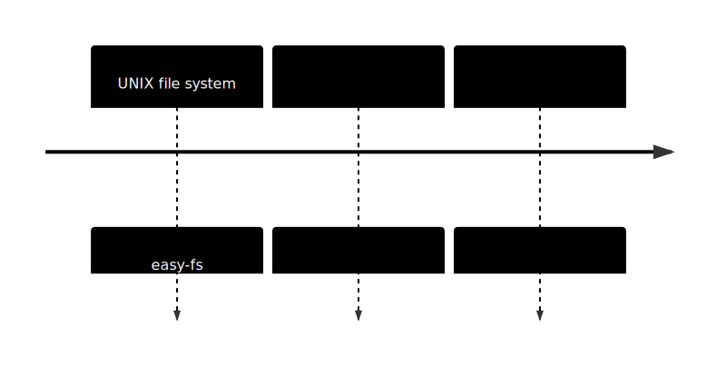
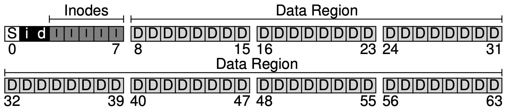
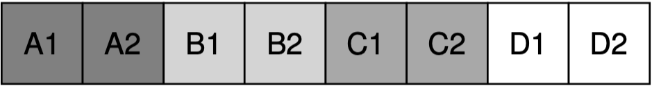
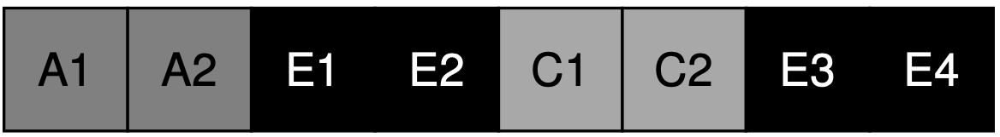
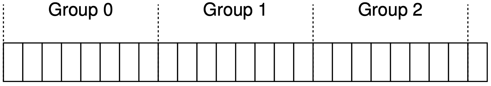
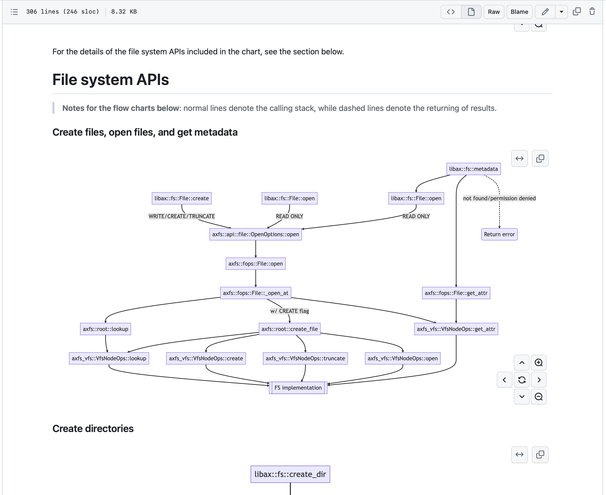
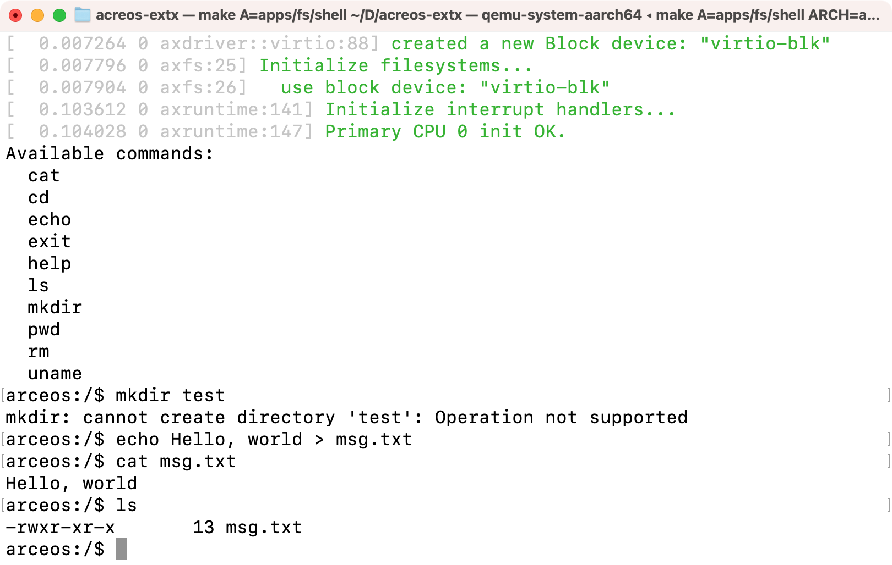

<!-- _footer: '' -->
<!-- _class: lead -->
<!-- _paginate: false -->

# Ext2/3

**梁业升**
OS Lab Report · Midterm

---

<!-- _header: Outline -->
<!-- _footer: '' -->
<!-- _class: lead -->

1. 相关文件系统的设计思想
2. Arceos 文件系统模块架构
3. Easy-fs 在 Arceos 上的移植
4. 后续计划

---

<!-- _header: Outline -->
<!-- _footer: '' -->
<!-- _class: lead -->

1. **相关文件系统的设计思想**
2. Arceos 文件系统模块架构
3. Easy-fs 在 Arceos 上的移植
4. 后续计划

---

<!-- header: Design of Related File Systems  -->



---

<!-- footer: Design of related file systems -->
<!-- header: The (Old) UNIX File System -->

- **Inode structure**
  - Superblock
  - Bitmaps
  - Inodes
  - Data blocks
  
- Multi-level index
---

- Inode structure
- **Multi-level index**
  - Direct
  - Indirect
  - Double indirect

---

<!-- _header: Problems of the UNIX File System -->

- **Poor performance**
  - 2% of disk bandwidth in the worst case
  - Main issue: disk is treated as a RAM -- positioning costs
    - e.g. data blocks are far away from the inode
- **Fragmentation**

  
  

---

<!-- header: Fast File System -->

**Block groups**



- Each group is like a file system
  
  

- Accessing blocks within the same group is fast

---

Allocation policy: **keep related stuff together**

- **Directories**: allocate to the group that has
  - small number of directories -- unrelated stuff
  - large number of free inodes -- related stuff
- **Files**: allocate the same group for
  - inode and data blocks
  - files within the same directory
- **Large files**
  - direct blocks follow the rule above
  - other large chunks are placed in other groups

---

<!-- _class: lead -->

Certainly all modern systems account for the main lesson of FFS:
**treat the disk like it’s a disk**.

*Operating Systems: Three Easy Pieces*

---

<!-- header: Journaling File System (ext3) -->

Major challenge: **crash-consistency problem**

Solution: **write-ahead logging**, or **WAL**

- Write logs before writing to disk
- Place the journal on the disk (for persistence)
- Recover from the journal

---

- Every file system operation is a **transaction**
  - updates on inode, bitmap, data blocks, ...

    
  - atomicity? needs a **two-step** approach

    
    <small>(atomicity of `TxE` is guaranteed if the size of `TxE` == 512 bytes)</small>
- After **checkpoints**, the transaction is on disk and the log space can be reused

---

<!-- _header: Other Tricks Used in Ext3 -->

- Batched log updates
  - Multiple operations may modify the same data (e.g. the bitmaps)
- Circular log
  - The log is of a finite size
  
- Metadata journaling
  - With data logs: twice the write size
  - Only records the metadata modification (inodes, bitmaps, ...)
  - Write data blocks to the disk, then write the log

---

<!-- _header: Outline -->
<!-- _footer: '' -->
<!-- _class: lead -->

1. 相关文件系统的设计思想
2. **Arceos 文件系统模块架构**
3. Easy-fs 在 Arceos 上的移植
4. 后续计划

---

<!-- header: Arceos 文件系统架构 -->
<!-- footer: '' -->



- `libax::fs`: 用户库，暴露 `axfs::api` 接口
- `axfs::api`: 提供给用户程序的 API
- `axfs::fops`: 底层 API
- `axfs_vfs`: 虚拟文件系统接口

---

<!-- header: 例子：切换当前目录 -->
<!-- footer: Arceos 文件系统架构 -->



---

<!-- header: 编写文档 -->

`doc/apps_fs_shell.md`



---

<!-- _header: Outline -->
<!-- _footer: '' -->
<!-- _class: lead -->

1. 相关文件系统的设计思想
2. Arceos 文件系统模块架构
3. **Easy-fs 在 Arceos 上的移植**
4. 后续计划

---

<!-- header: Easy-fs 在 Arceos 上的移植 -->
<!-- footer: '' -->

- **提供虚拟文件系统接口**
  - `VfsOps` trait for `EasyFileSystem`
    ```rust
    fn root_dir(&self) -> VfsNodeRef
    ```
  - `VfsNodeOps` trait for `Inode`
    ```rust
    fn read_at(&self, offset: u64, buf: &mut [u8]) -> VfsResult<usize>
    fn write_at(&self, offset: u64, buf: &[u8]) -> VfsResult<usize>
    ...
    ```
- 在 `axfs` 中根据 feature 静态选择根文件系统类型
- `libax` 根据自身 feature 开启 `axfs` 对应的 feature
- 编译应用时传递 feature 给 `libax`

---

- 提供虚拟文件系统接口
- **在 `axfs` 中根据 feature 静态选择根文件系统类型**
  ```rust
  cfg_if::cfg_if! {
      if #[cfg(feature = "easyfs")] {
          let main_fs = fs::easyfs::EasyFileSystem::new(disk);
      } else if #[cfg(feature = "fatfs")] {
          let main_fs = fs::fatfs::FatFileSystem::new(disk);
      } else {
          compile_error!("no filesystem is enabled")
      }
  }
  ```
- `libax` 根据自身 feature 开启 `axfs` 对应的 feature
- 编译应用时传递 feature 给 `libax`

---

<!-- _footer: '' -->

- 提供虚拟文件系统接口
- 在 `axfs` 中根据 feature 静态选择根文件系统类型
- **`libax` 根据自身 feature 开启 `axfs` 对应的 feature**
  ```toml
  # ulib/libax/Cargo.toml
  fs = ["alloc", "axruntime/fs", "dep:axfs"]
  fs_easyfs = ["axfs?/easyfs"]
  fs_fatfs = ["axfs?/fatfs"]
  ```
- 编译应用时传递 feature 给 `libax`

---

<!-- _footer: '' -->

- 提供虚拟文件系统接口
- 在 `axfs` 中根据 feature 静态选择根文件系统类型
- `libax` 根据自身 feature 开启 `axfs` 对应的 feature
- **编译应用时传递 feature 给 `libax`**
  ```toml
  # apps/fs/shell/Cargo.toml
  [features]
  fatfs = ["libax/fs_fatfs"]
  easyfs = ["libax/fs_easyfs"]

  [dependencies]
  libax = { path = "../../../ulib/libax", features = ["fs"] }
  ```

---

<!-- _header: Run & Outputs -->
<!-- footer: Easy-fs 在 Arceos 上的移植 -->

```
make A=apps/fs/shell FS=y APP_FEATURES=easyfs run
```



---

<!-- _header: Outline -->
<!-- _footer: '' -->
<!-- _class: lead -->

1. 相关文件系统的设计思想
2. Arceos 文件系统模块架构
3. Easy-fs 在 Arceos 上的移植
4. **后续计划**

---

<!-- header: 后续计划 -->
<!-- _footer: '' -->

1. 研究 ext2/ext3 源码
2. 分工完成 ext2/ext3 实现
   - FS Ops
   - Journal
3. 在用户态进行测试
4. 发布 crate / 接入 Arceos
5. 参考现代文件系统进行优化/提出新的优化方案（？）

---

<!-- _header: '' -->
<!-- _footer: '' -->
<!-- _class: lead -->
<!-- _paginate: false -->

## Thanks! Questions?
