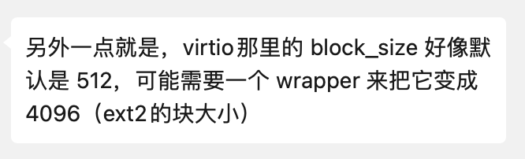

<style>
.sec {
   opacity: 75% 
}
h1, h2 {
  color: #146C94;
}
</style>

<style>
  :root {
    --color-background: #fff;
    --color-foreground: #333;
    --color-highlight: #146C94;
    --color-dimmed: #00000088;
  }
</style>

<!-- _footer: '' -->
<!-- _class: lead -->

# ~~Ext4~~ Ext2 (First)

*OS Lab Report · Week 7 · 梁业升*

---

## 本周工作

- 讨论并确定开发计划
  - 放弃直接写 ext4
  - 先支持 ext2，再
    - 扩展到 ext3，或/和
    - 增加一些 ext4 的功能
- 阅读 ext2 材料
- 一些准备工作
  - 编写用户态测试用 `BlockDevice`

---

## 定义 Block Device

- 参考 rCore 中 easy-fs
- 增加 `BLOCK_SIZE` 以适应与 ext2 的 block size 不同的块设备



```rust
pub trait BlockDevice: Send + Sync + Any {
    const BLOCK_SIZE: usize;
    fn read_block(&self, block_id: usize, buf: &mut [u8]);
    fn write_block(&self, block_id: usize, buf: &[u8]);
}
```


---

## Block Device 的 Adaptor

```rust
impl<B: BlockDevice> BlockDevice for BlockDeviceAdaptor<B> {
    const BLOCK_SIZE: usize = B::BLOCK_SIZE;

    fn read_block(&self, block_id: usize, buf: &mut [u8]) {
        assert_eq!(EXT2_BLOCK_SIZE % B::BLOCK_SIZE, 0);
        let num_inner_blocks = EXT2_BLOCK_SIZE / B::BLOCK_SIZE;
        for inner_id in 0..num_inner_blocks {
            self.inner.read_block(
                block_id * num_inner_blocks + inner_id,
                &mut buf[inner_id * B::BLOCK_SIZE..(inner_id + 1) * B::BLOCK_SIZE],
            );
        }
    }
}
```

---

## 为用户态实现 Block Device

- 参考 rCore 中 easy-fuse
- `FileDevice`：使用文件
- `RamDevice`：使用内存
- 支持对不同的设备 block size 进行测试

```rust
pub struct FileDevice<const BS: usize>(Mutex<File>);

impl<const BS: usize> BlockDevice for FileDevice<BS> {
    const BLOCK_SIZE: usize = BS;
    ...
}
```

---

## 下周计划

- 文件系统的创建
- Block Allocator
