<!-- _footer: '' -->
<!-- _class: lead -->
<!-- _paginate: false -->

# Journaling Block Device (JBD)

**梁业升**
OS Lab Report · Week 9

---

<!-- _header: 本周工作 -->
<!-- footer: OS Lab Report · Week 9 -->

1. 研究 Linux 的 Ext3 及 JBD（Journaling Block Device）层源码
2. JBD 在 Rust 上的部分实现

---

<!-- _header: Journaling Block Device Layer -->

- 并不包含在 ext3/ext4 中
- 为块设备提供日志功能
- 文件系统将修改（事务）发送给 JBD

```
-------------------------------------------------------------------------------
Language                     files          blank        comment           code
-------------------------------------------------------------------------------
C                                6            916           2274           4150
C/C++ Header                     1            160            475            397
make                             1              2              3              2
-------------------------------------------------------------------------------
SUM:                             8           1078           2752           4549
-------------------------------------------------------------------------------
```

---

<!-- _header: Ext3 的三种挂载模式 -->

<div class="twocols">

- `journal`: 元数据和数据都写到日志中
- `ordered`: 只写元数据，数据在写日志前写回磁盘
- `writeback`: 只写元数据，不强制数据先写回


<p class="break"></p>


</div>

---

<!-- _footer: Ext3 与 JBD 的交互 -->

<style scoped>
header {
  height: 0px;
}
</style>



---

<!-- _header: 实现上的问题 & 解决方法 -->

<div class="twocols">

**问题 1**：对操作系统的要求

- 某些功能与操作系统紧耦合，如统一的 buffer 管理
- 某些功能需要操作系统的支持，如异步 I/O、条件变量（sleep lock）

<p class="break"></p>

**解决方法**：增加操作系统抽象层

- 使用 trait 对在 Linux 中由操作系统提供的功能进行抽象
- 实际接入操作系统/用户态程序时实现兼容    

</div>


--- 

<!-- _header: 实现上的问题 & 解决方法 -->

<div class="twocols">

**问题 2**：从 C 到 Rust 的翻译

- 某些数据结构（如链表）的 Rust 实现与 C 差别很大
- 所有权与生命周期使得数据共享较为复杂
- goto 语句的翻译较为复杂
  ```rust
  'l1: loop {
    continue 'l1 // goto
    break;
  }
  ```

<p class="break"></p>

**机遇**：更可靠的实现

```c
spin_lock(&journal->j_state_lock);
sb->s_sequence = cpu_to_be32(journal->j_tail_sequence);
sb->s_start    = cpu_to_be32(journal->j_tail);
sb->s_errno    = cpu_to_be32(journal->j_errno);
spin_unlock(&journal->j_state_lock);
```

```rust
let states = self.states.lock();
sb.sequence = states.tail_sequence.to_be();
sb.start = states.tail.to_be();
sb.errno = states.errno.to_be();
drop(states) // unlock
```

</div>

---

<!-- _header: 目前进展 -->

<small>
<div class="twocols">

- 基本架构设计
  - 磁盘数据结构
  - 配置（C 中的宏定义）
  - 系统兼容层
  - 日志管理
  - 事务处理
- 日志管理
  - `init_dev`：构造内存中的 journal 对象
  - `create`：在磁盘上创建日志结构
  - `load`：读取磁盘上的日志结构
  - `recover`：故障恢复
  - `wipe`：擦除已有的日志

<p class="break"></p>

```
.
└── src
    ├── disk.rs
    ├── config.rs
    ├── sal.rs
    ├── journal.rs
    ├── tx.rs
    ├── ...
```

</div>
</small>

---

<!-- _header: 下周计划 & 总体目标 -->

- 完善架构设计
- 继续实现 JBD：事务处理

目标：

- 实现 Ext3 并接入 ArceOS
- 可替换 Linux 中的紧耦合 JBD 模块
  - 与已有的文件系统（Ext3/4 等）兼容
  - 对抽象层设计与实现要求较高
- 可替换 Linux 中的 Ext3
