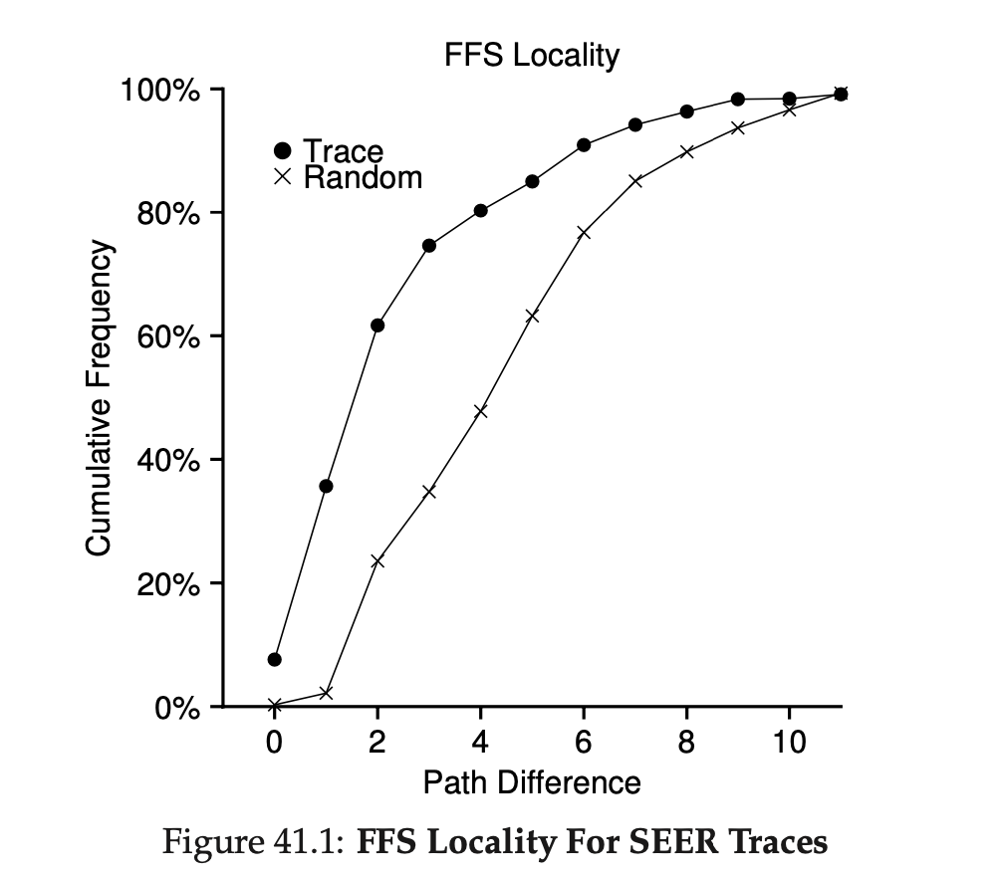

<style>
.sec {
   opacity: 75% 
}
h1, h2 {
  color: #146C94;
}
</style>

<style>
  :root {
    --color-background: #fff;
    --color-foreground: #333;
    --color-highlight: #146C94;
    --color-dimmed: #146C94CC;
  }
</style>

<!-- _footer: '' -->
<!-- _class: lead -->

# Arceos Hello World & Ext4

*OS Lab Report · Week 6 · 梁业升*

---

## 本周工作

- 阅读 arceos 代码，理解整体框架
- 了解 ext4 文件系统

---

## Arceos Hello World 分析



- `axconfig` 定义硬件配置
- `axhal` 平台相关实现，提供平台无关接口 + 生成链接脚本
- `axruntime` 在 HAL 基础上，进行操作系统初始化

---

<!-- _footer: '' -->

## Arceos Hello World 分析


```rust
fn main() {
    libax::println!("Hello, world!");
}
```

<style scoped>
p, li {
  font-size: 30px;
}
</style>

hello-world 运行步骤：

1. 执行 `axhal` 中的 `_start`，初始化栈、CSR 等
2. 跳转到 `axruntime` 的 `rust_main`，进行其他初始化
3. 跳转到用户程序 `main`，调用 `axlog::println`

---

<!-- _footer: '' -->

## Ext4 

ext4 的特点：

- 日志式文件系统
- 大文件系统
- 改进的块分配模式：减小碎片化
  - 区段：连续分配的块
  - 预分配：预先分配文件的数据块（`fallocate` 系统调用）
  - 延迟分配：写回时才分配物理块

<small class="sec"><em>ref: https://en.wikipedia.org/wiki/Ext4</em></small>

---

## Ext4 

ext4 的特点（cont.）：

- 无限子文件夹
  - HTree Index
- 日志校验
- 纳秒级时间戳
- ...

--- 

<!-- _footer: '' -->

## Ext4 Block/Inode Allocation Policy

**Trick #1: Multi-block Allocator**

- 创建文件时，分配 8KB block 空间（2 blocks）
- 关闭文件时
  - 没有用到的块被回收
  - 若用完，则写到 extent 中

**Trick #2: Delayed Allocation**

- 直到写回脏页时才分配磁盘空间

--- 

## Ext4 Block/Inode Allocation Policy

**Trick #3: Block Groups**

- 将磁盘分为若干 block group
- 局部性
- 源于 Fast File System (FFS)

**Trick #4: Same Block Group for Data and Inode**

- 尽量将数据块和 inode 放置在同一个 block group 中
- 减少寻道开销

--- 

## Ext4 Block/Inode Allocation Policy



**Trick #5: Same Block Group for Directory and Its Content**

- 尽量将目录和目录下文件的 inode 放置在同一个 block group 中
- 相同文件夹下的文件通常有关联

---

<!-- ## Ext4 on Arceos

- 可以作为 crate 独立于 OS
  - 需要 OS 实现额外的接口（如 `fallocate`）
- 核心模块相对独立（？）
  - Journal
  - Allocator
  - Defragmentation tool（`e4defrag`）
  - ... -->

## 下周计划

- 与助教/同学讨论
  - 模块划分
  - 功能界限（i.e. 哪些可以独立于 OS）
- 继续阅读 ext4 文档/源码
